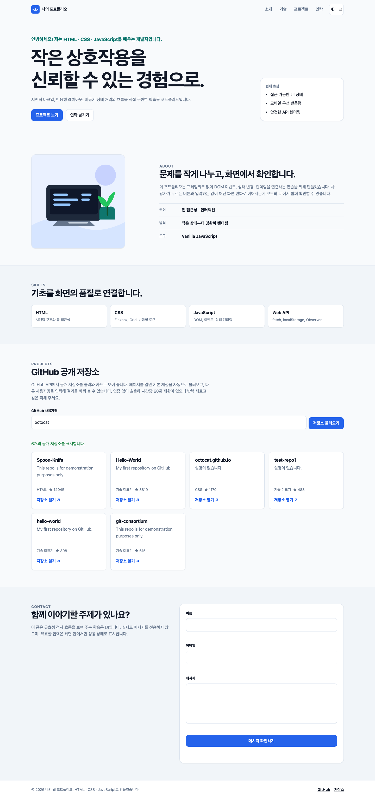
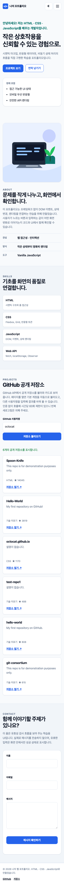
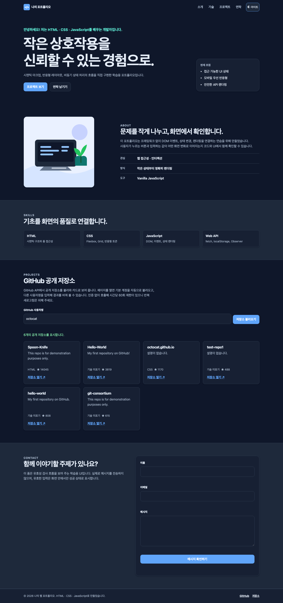
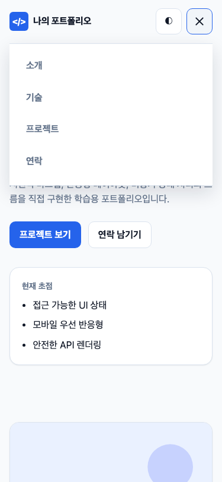
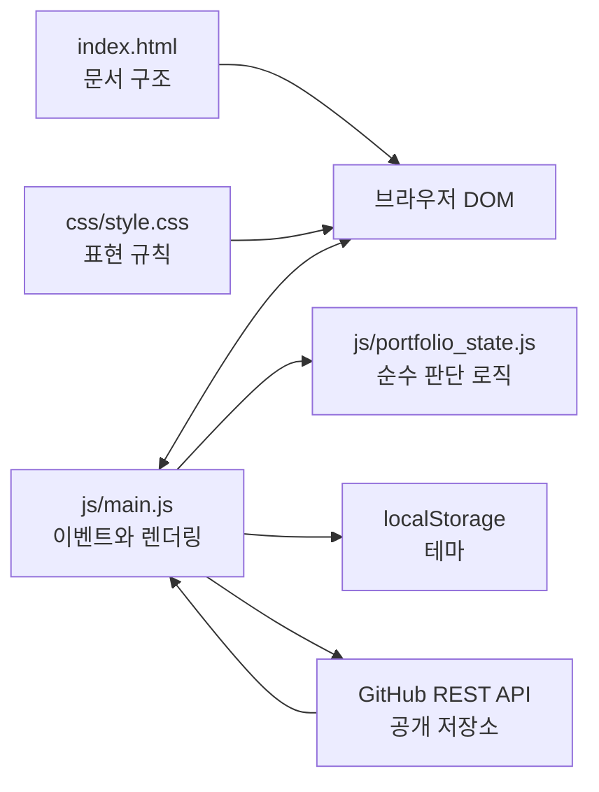
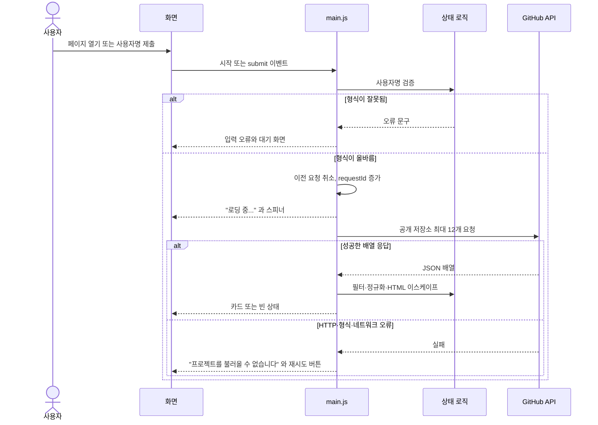
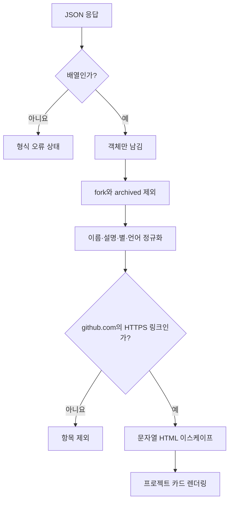

# 나만의 반응형 웹 포트폴리오

순수 HTML, CSS, JavaScript만으로 만든 한 페이지 포트폴리오입니다. 모바일부터 데스크톱까지 화면 크기에 맞춰 배치가 바뀌고, 테마·메뉴·문의 폼·GitHub 저장소 목록이 사용자의 행동에 따라 화면을 다시 그립니다. 웹 기초 완성 미션(B1-1)의 결과물입니다.

| 항목 | 주소 |
| --- | --- |
| 배포 URL (GitHub Pages) | <https://minkyu01.github.io/B1-1_portfolio-web/> |
| GitHub 저장소 | <https://github.com/Minkyu01/B1-1_portfolio-web> |

> **배포 상태 (2026-09-19):** 저장소를 조직 `codyssey0`에서 `Minkyu01` 계정으로 옮겼고, 새 주소로 재배포한 뒤 확인하는 중입니다. 새 주소에서의 검증 결과는 [제출 안내](docs/submission.md)의 배포 기록에 적습니다.

## 프로젝트 소개

이 프로젝트의 핵심은 **이벤트 → 상태 변경 → DOM 업데이트**입니다. 이벤트는 클릭이나 입력처럼 브라우저에서 일어난 일입니다. 상태는 현재 테마, 메뉴가 열렸는지, API 요청이 어느 단계인지 같은 값입니다. DOM(Document Object Model)은 JavaScript가 읽고 바꿀 수 있는 웹 문서 구조입니다.

페이지에는 Hero(인사말·CTA), About(자기소개·프로필 이미지), Skills, Projects(GitHub API 카드), Contact(문의 폼), Footer가 있습니다. 페이지를 열면 GitHub API에서 기본 계정(`Minkyu01`)의 공개 저장소를 자동으로 불러와 카드로 보여 주고, 로딩·성공·빈 결과·오류(재시도 버튼 포함)를 각각 다른 화면으로 표현합니다. 입력창에 다른 사용자명을 넣으면 그 계정의 저장소로 목록이 바뀝니다.

## 스크린샷

| 데스크톱 (1440px) | 모바일 (375px) | 다크 모드 |
| --- | --- | --- |
|  |  |  |

모바일에서 햄버거 버튼을 누른 모습입니다.



> Projects 카드는 GitHub 사용자명 입력창에 `octocat`을 넣어 **실제 GitHub API**로 불러온 결과입니다. 기본 계정에 공개 저장소가 없으면 카드 대신 "표시할 프로젝트가 없습니다." 빈 상태가 나옵니다. 스크린샷은 `node tests/e2e_browser.mjs --live --screenshots`로 다시 만들 수 있습니다.

## 사용 기술

| 영역 | 사용한 것 | 쓴 이유 |
| --- | --- | --- |
| HTML | 시맨틱 태그(`header`·`nav`·`main`·`section`·`article`·`footer`), `label`의 `for`와 입력의 `id` 연결, 모든 이미지의 `alt`, `aria-*` 속성 | 태그 이름만으로 영역의 역할이 드러나고, 화면 읽기 도구와 검색 엔진이 구조를 이해합니다. |
| CSS | CSS 변수(`:root`, `[data-theme="dark"]`), Flexbox(내비게이션), Grid(`auto-fit`·`minmax` 카드), 모바일 우선 미디어 쿼리(768px·1024px), `hover`·`transition`·`box-shadow` | 색·간격을 한곳에서 관리하고, 다크 모드는 같은 변수의 값만 바꿉니다. |
| JavaScript | ES 모듈, 화살표 함수, 구조분해 할당, 템플릿 리터럴, `map`·`filter`·`forEach`, `fetch`·`async`/`await`·`try`/`catch`, `AbortController`, `IntersectionObserver`, `localStorage`, `classList`, `addEventListener` | 브라우저 기본 기능만으로 상태와 화면을 연결합니다. |
| 외부 API | GitHub REST API `GET /users/{id}/repos` | 인증 없이 공개 저장소 목록을 가져옵니다. |
| 개발 환경 | VS Code + Live Server | 저장하면 브라우저가 바로 새로 고쳐집니다. |
| 테스트 | Node.js(상태·가짜 DOM), Python 3(정적 계약), Chrome DevTools Protocol(실제 브라우저) | 별도 패키지 설치 없이 실행됩니다. |
| 배포 | GitHub Pages | 빌드 없이 정적 파일을 그대로 제공합니다. |

React, Vue, jQuery, Bootstrap, Tailwind CSS 같은 외부 라이브러리와 웹 폰트는 쓰지 않았습니다. 글꼴은 운영체제 기본 글꼴(`system-ui`)입니다.

## 배포

GitHub Pages는 브랜치의 파일을 그대로 서비스합니다. 이 저장소는 별도 빌드가 필요 없고, **`gh-pages` 브랜치**를 배포 브랜치로 씁니다.

1. 코드를 고치고 `main`에 커밋합니다.
2. `main`의 내용을 `gh-pages`로 올립니다. 처음 `gh-pages`를 push하면 GitHub가 Pages를 자동으로 켜고, 이후에는 push할 때마다 사이트가 갱신됩니다.

   ```bash
   git push origin main:gh-pages
   ```

3. 1분쯤 뒤 <https://minkyu01.github.io/B1-1_portfolio-web/>에서 확인합니다.

`gh-pages`는 `main`의 사본이라 `main`만 고치고 올리지 않으면 사이트는 예전 그대로입니다. 브랜치를 하나로 줄이고 싶다면 저장소 **Settings → Pages**에서 **Source: Deploy from a branch**, **Branch: `main` / `(root)`**로 바꾸고 `gh-pages`를 지우면 됩니다.

저장소 루트의 빈 `.nojekyll` 파일은 GitHub Pages가 Jekyll 변환을 건너뛰고 파일을 그대로 서비스하게 합니다.

배포된 주소도 로컬과 같은 기준으로 검사할 수 있습니다.

```bash
node tests/e2e_browser.mjs --url=https://minkyu01.github.io/B1-1_portfolio-web/
```

## 실행 방법

### VS Code + Live Server (권장)

1. VS Code에서 이 폴더를 엽니다. 추천 확장(Live Server)을 설치하라는 알림이 뜹니다.
2. `index.html`을 우클릭하고 **Open with Live Server**를 선택합니다. 기본 주소는 `http://127.0.0.1:5500`입니다.
3. 파일을 저장하면 브라우저가 자동으로 새로 고쳐집니다.

### 터미널

Python 3만 있으면 됩니다.

```bash
npm run start
```

`npm`이 없다면 `python3 -m http.server 4173 --directory .`를 직접 실행해도 같습니다. 브라우저에서 `http://localhost:4173`을 엽니다. 종료는 `Ctrl+C`입니다.

> `index.html`을 더블 클릭해 `file://`로 열면 Chrome이 ES 모듈(`type="module"`) 로드를 막습니다. 화면은 보이지만 테마·메뉴·API 같은 JavaScript 기능이 동작하지 않으니 Live Server나 배포 주소를 사용하세요.

### 첫 동작 확인

1. 페이지를 열면 Projects에 "로딩 중..."이 잠깐 보이고 저장소 카드(또는 빈 상태)로 바뀝니다.
2. 테마 버튼을 누르고 새로고침합니다. 선택한 테마가 유지되어야 합니다.
3. GitHub 사용자명에 `octocat`을 입력하고 **저장소 불러오기**를 누릅니다.
4. 문의 폼을 빈 채로 제출하면 각 입력 칸 가까이에 오류가 보입니다.
5. 창 폭을 767px 이하로 줄이면 메뉴가 숨고 햄버거 버튼이 나타납니다.

GitHub API는 인증 없이 호출하므로 시간당 60회 제한이 있습니다. 짧은 시간에 계속 새로고침하지 마세요. 제한에 걸리면(403) 에러 상태와 재시도 버튼이 나옵니다.

## 실행 환경과 입출력

| 구분 | 내용 |
| --- | --- |
| 실행 대상 | 최신 Chrome |
| 외부 패키지 | 없음 |
| 외부 통신 | 페이지를 열 때와 사용자명을 제출할 때 GitHub 공개 REST API 호출 |
| 주요 입력 | 테마·메뉴 클릭, 스크롤 위치, GitHub 사용자명, 문의 폼 값 |
| 주요 출력 | 테마와 메뉴 상태, 저장소 카드, 로딩·오류·성공 안내, 스크롤 효과 |
| 브라우저 저장 | `localStorage`의 `portfolio-theme` 키에 `light` 또는 `dark` 하나 |
| 서버 저장 | 없음 |

`localStorage`는 브라우저 안에 작은 값을 보관하는 공간입니다. GitHub 응답과 문의 내용은 저장하지 않습니다.

## 주요 기능과 기준값

| 영역 | 실제 동작 |
| --- | --- |
| 페이지 구조 | Hero, About, Skills, Projects, Contact, Footer를 시맨틱 태그로 구분 |
| 반응형 화면 | 모바일 우선 CSS, `768px`·`1024px` 분기, Flexbox 메뉴와 Grid 카드 |
| 모바일 메뉴 | 햄버거 버튼으로 열고 닫으며 `classList.toggle('active')`와 `aria-expanded`가 함께 바뀜 |
| 테마 | 라이트·다크 전환 후 `localStorage`에 저장 |
| 페이지 이동 | 메뉴와 CTA 링크가 섹션까지 부드럽게 스크롤 |
| 스크롤 반응 | 헤더 배경 변경, 맨 위로 버튼 노출 |
| 등장 효과 | 요소가 일정 비율 보이면 한 번 나타남 |
| GitHub Projects | 공개 저장소 최대 12개를 최신 업데이트 순으로 요청해 카드로 표시 |
| API 상태 | 대기, 로딩, 성공, 빈 결과, 오류와 재시도를 각각 표시 |
| 문의 폼 | 필수값과 이메일 형식을 검사하고 화면 안에서 성공 안내 |
| 접근성 보조 | 본문 건너뛰기, 연결된 label, alt, `aria-live`, 키보드 초점 표시 |

명세가 "기준값은 바꿔도 되지만 README에 명시"하라고 한 값입니다.

| 기능 | 기준 | 이유 |
| --- | ---: | --- |
| 맨 위로 버튼 노출 | `300px` 이상 | 명세 예시와 같은 값입니다. 첫 화면을 가리지 않고 충분히 내려간 뒤 나타납니다. |
| 헤더 배경 변경 | `60px` 이상 | 명세 예시와 같은 값입니다. 조금만 내려가도 메뉴 경계가 구분됩니다. |
| 등장 효과(`IntersectionObserver` threshold) | `0.25` | 권장값(0.2 이상)을 지켰습니다. 요소의 25%가 보이면 한 번 실행합니다. |

사용자가 운영체제에서 움직임 줄이기를 켰거나 브라우저가 `IntersectionObserver`를 지원하지 않으면 등장 애니메이션을 건너뛰고 내용을 바로 보여 줍니다.

## 디렉터리 구조

```text
B1-1_portfolio-web/
├── index.html                    # 페이지 구조와 문구
├── css/
│   └── style.css                 # 색상, 레이아웃, 반응형, 상태 스타일
├── js/
│   ├── main.js                   # DOM 선택, 이벤트 연결, 화면 렌더링
│   └── portfolio_state.js        # 검증, API 데이터 정제, 카드 생성
├── images/
│   ├── profile-placeholder.svg   # About 프로필 이미지(alt 포함)
│   └── favicon.svg               # 탭 아이콘
├── tests/
│   ├── run_all.sh                # 모든 자동 검사 진입점
│   ├── test_state.mjs            # 순수 상태·검증·안전한 카드 테스트
│   ├── test_main_dom.mjs         # 가짜 DOM에서 UI 상태 전환 테스트
│   ├── test_static_contract.py   # HTML·CSS·JS·문서 정적 계약 검사
│   ├── e2e_browser.mjs           # 실제 Chrome에서 명세 조항별 종단 테스트
│   └── cdp_helper.mjs            # e2e가 쓰는 Chrome 조종 도우미(외부 패키지 없음)
├── docs/
│   ├── design.md                 # 설계 근거와 상태 모델
│   ├── requirements-traceability.md # 명세 조항 → 구현 → 검증 대응표
│   ├── review_checklist.md       # 자동·수동 검토 목록
│   ├── peer-review.md            # 동료 평가 시연 방법과 설명 포인트
│   ├── submission.md             # 제출물과 배포 기록
│   └── screenshots/              # 데스크톱·모바일·다크 모드 스크린샷
├── .nojekyll                     # Pages가 Jekyll 변환을 건너뛰게 하는 빈 파일
├── .vscode/extensions.json       # Live Server 추천 확장
├── package.json                  # ES 모듈 선언과 실행·검사 명령
└── README.md
```

## 전체 구조



`portfolio_state.js`는 브라우저 화면 없이도 검사할 수 있는 규칙을 맡습니다. `main.js`는 그 규칙을 DOM 요소와 브라우저 API에 연결합니다. 이 분리 덕분에 네트워크와 실제 브라우저 없이도 많은 실패 흐름을 재현할 수 있습니다.

## 이벤트에서 화면까지

| 사용자 행동 | 바뀌는 상태 | 화면 결과 |
| --- | --- | --- |
| 페이지 열기 | `projects.status`, `requestId` | 로딩, 그리고 카드·빈 결과·오류 중 하나 표시 |
| 테마 버튼 클릭 | `theme` | `data-theme`, 버튼 이름, 저장값 변경 |
| 메뉴 버튼 클릭 | `menuOpen` | 메뉴 클래스와 `aria-expanded` 변경 |
| GitHub 사용자명 제출 | `projects.status`, `requestId` | 로딩, 그리고 카드·빈 결과·오류 중 하나 표시 |
| 재시도 버튼 클릭 | `projects.status`, `requestId` | 같은 사용자명으로 다시 요청 |
| 문의 입력 | 해당 필드의 `errors` | 수정한 칸의 오류와 이전 성공 문구 갱신 |
| 문의 제출 | 모든 `errors`, `success` | 오류 표시 또는 확인 문구와 폼 초기화 |
| 스크롤 | 상태 객체에 저장하지 않고 현재 `scrollY` 판정 | 헤더 강조와 맨 위 버튼 표시 |

### GitHub 저장소 요청 순서



### Projects 섹션의 다섯 가지 상태

| 상태 | 언제 | 화면 |
| --- | --- | --- |
| `idle` | 사용자명이 비었거나 형식이 잘못됨 | 입력 안내 문구와 입력 칸 근처의 오류 |
| `loading` | 요청 중 | 돌아가는 스피너와 "로딩 중..." |
| `success` | 저장소가 1개 이상 | 카드 목록과 "N개의 공개 저장소를 표시합니다." |
| `empty` | 요청은 성공했지만 표시할 저장소가 0개 | "표시할 프로젝트가 없습니다." |
| `error` | HTTP 오류, 응답 형식 오류, 네트워크 실패 | "프로젝트를 불러올 수 없습니다." + 원인 안내 + **다시 시도** 버튼 |

## 핵심 로직

### 1. 사용자명과 문의 값 검증

GitHub 사용자명은 앞뒤 공백을 없앤 뒤 검사합니다. 영문자, 숫자, 하이픈으로 된 1~39자만 허용합니다. 하이픈은 맨 앞이나 맨 뒤에 올 수 없습니다.

문의 값도 먼저 공백을 정리합니다. 이름과 메시지는 비어 있으면 실패합니다. 이메일은 `@` 앞뒤와 점 뒤에 문자가 있는 간단한 형식을 검사합니다. 이 검사는 학습용 형식 검사이며 실제 이메일 주소의 존재를 확인하지는 않습니다.

### 2. GitHub 응답 정제



`filter`로 조건에 맞는 항목만 남기고, `map`으로 필요한 필드만 뽑아 정규화한 뒤, 카드 HTML 문자열로 다시 `map`합니다. HTML 이스케이프는 `<` 같은 문자를 화면용 문자로 바꾸는 처리입니다. 저장소 이름이나 설명이 HTML 태그로 실행되는 일을 막습니다. 링크는 `https://github.com` 주소만 허용하고, 새 탭 링크에는 `noopener noreferrer`를 붙입니다.

### 3. 오래된 요청이 화면을 덮지 못하게 하기

사용자가 A를 요청한 직후 B를 요청하면 A가 늦게 끝날 수 있습니다. 그대로 두면 B 화면 위에 A 결과가 나타납니다. 이 프로젝트는 두 겹으로 막습니다.

1. `AbortController`로 A의 네트워크 요청을 취소합니다.
2. 요청마다 `requestId`를 1씩 올립니다. 응답의 ID가 현재 ID와 다르면 화면을 바꾸지 않습니다.

잘못된 사용자명을 새로 제출해도 같은 방식으로 진행 중 요청을 취소합니다. 페이지를 열 때 시작한 자동 요청도 같은 규칙을 따릅니다.

## 데이터가 이동하는 경로

| 데이터 | 입력 | 처리 | 저장 | 출력 |
| --- | --- | --- | --- | --- |
| 테마 | 테마 버튼 | light/dark 전환 | 브라우저 `localStorage` | 문서의 `data-theme`와 버튼 설명 |
| 메뉴 | 햄버거 버튼 | 불리언 값 반전 | 메모리 상태 | 메뉴 클래스와 접근성 속성 |
| 저장소 | 기본 계정 또는 입력한 사용자명 | 검증 → fetch → 필터 → 정제 | 현재 페이지 메모리 | 상태 문구와 저장소 카드 |
| 문의 | 이름·이메일·메시지 | 공백 정리와 형식 검사 | 전송·영구 저장 안 함 | 필드 오류 또는 성공 안내 |

페이지를 새로고침하면 메뉴, API 결과, 문의 값은 사라집니다. 테마만 남습니다.

## 실패 흐름과 예외 처리

| 상황 | 처리 결과 |
| --- | --- |
| 빈 GitHub 사용자명 | API를 부르지 않고 입력 가까이에 안내 표시 |
| 잘못된 사용자명 형식 | 진행 중 요청 취소 후 대기 상태로 복귀 |
| HTTP 403·429 | "프로젝트를 불러올 수 없습니다." + 요청 한도 안내와 재시도 버튼 |
| HTTP 404 | "프로젝트를 불러올 수 없습니다." + 사용자를 찾지 못했다는 안내와 재시도 버튼 |
| 응답이 배열이 아님 | 빈 목록이 아니라 응답 형식 오류로 처리 |
| 네트워크 오류 | "프로젝트를 불러올 수 없습니다." + 네트워크 안내와 재시도 버튼 |
| API 결과가 0개 | 오류가 아닌 빈 상태 표시 |
| 안전하지 않은 저장소 URL | 해당 항목을 카드 목록에서 제외 |
| `localStorage` 접근 실패 | 저장만 포기하고 현재 화면의 테마 전환은 유지 |
| 빈 문의 필드 | 필드마다 오류 문구와 `aria-invalid` 표시 |
| 올바른 문의 제출 | 값을 지우고 "실제 전송하지 않음" 안내 표시 |

## 테스트

Node.js 22 이상, Python 3, (선택) Chrome이 있는 환경에서 실행합니다. 별도 패키지 설치는 필요하지 않습니다.

```bash
npm run check
```

`npm`이 없다면 `bash tests/run_all.sh`를 실행합니다. 성공하면 다음과 같이 끝납니다.

```text
portfolio state tests: ok
portfolio DOM state tests: ok
portfolio static contract tests: ok
e2e browser tests: 59/59 passed
all portfolio tests passed
```

| 검사 | 확인하는 내용 | 확인하지 않는 내용 |
| --- | --- | --- |
| `node --check` | 두 JavaScript 파일의 문법 | 실제 브라우저 동작 |
| `test_state.mjs` | 초기 상태, 기준값, 입력 검증, 응답 필터, HTML 정제, 오류 문구 | 실제 GitHub 서버 응답 |
| `test_main_dom.mjs` | 가짜 DOM에서 자동 로드·로딩·성공·빈 결과·403·재시도·형식 오류·요청 취소·기준값 경계·테마·메뉴·문의 폼 | CSS 배치, 실제 스크롤 |
| `test_static_contract.py` | 파일, 시맨틱 태그, label·alt, CSS 변수·분기, 금지 라이브러리, README 필수 항목 | 픽셀 단위 화면 |
| `e2e_browser.mjs` | 실제 Chrome에서 폭별 레이아웃(320~1440px), 햄버거·부드러운 스크롤·맨 위 버튼·헤더 변경·다크 모드 유지·등장 효과·폼·API 다섯 상태 | 다른 브라우저, 실제 기기 |

`e2e_browser.mjs`는 명세의 조항 번호(`[4.5-3]` 등)를 붙여 결과를 출력합니다. 기본 실행은 GitHub API를 모의 응답으로 바꾸므로 네트워크 없이도 동작하고 요청 한도를 쓰지 않습니다. Chrome이 없으면 건너뜁니다(`CHROME_PATH`로 위치를 지정할 수 있습니다).

| 명령 | 용도 |
| --- | --- |
| `npm run e2e` | 브라우저 종단 테스트만 실행 |
| `node tests/e2e_browser.mjs --live` | 실제 GitHub API도 낮은 빈도로 확인(요청 2건) |
| `node tests/e2e_browser.mjs --live --screenshots` | `docs/screenshots/`의 스크린샷 다시 만들기(라이브 검사 2건 + 스크린샷 4건 = 요청 6건) |
| `node tests/e2e_browser.mjs --url=<배포 주소>` | 배포된 사이트를 같은 기준으로 검사 |

2026-09-19에 Node.js `v24.18.1`, Python `3.10.20`, Chrome `153`에서 모두 통과했고, `--live`로 실제 API 호출도 확인했습니다. 배포된 주소(`--url`)에서도 59개 검사와 실제 API 확인을 통과했습니다.

### 직접 확인할 항목

자동 검사가 대신하지 못하는 것은 사람이 봐야 합니다.

- 키보드만으로 skip link, 메뉴, 폼을 끝까지 조작할 수 있는지(Tab 순서)
- 실제 스마트폰에서의 터치 조작과 글자 크기
- 다른 브라우저(Safari, Firefox)에서의 모양 — 명세 범위는 최신 Chrome입니다.

## 설계 결정 기록

완성 단계에서 정한 결정과 이유입니다.

- **명세 문구를 그대로 화면에 둔다.** 동료 평가는 명세의 문구로 확인하므로 로딩은 "로딩 중...", 오류는 "프로젝트를 불러올 수 없습니다", 빈 상태는 "표시할 프로젝트가 없습니다"로 맞췄습니다. 오류는 원인이 무엇이든 같은 첫 문장으로 시작하고 원인 안내를 덧붙입니다.
- **페이지를 열면 기본 계정을 자동으로 불러오고, 입력창은 남긴다.** 명세가 "본인의 저장소 목록을 가져와 렌더링"하라고 했기 때문입니다. 입력창은 평가하는 사람이 빈 결과·404·다른 계정 같은 상태를 직접 만들어 볼 수 있게 남겼습니다. 기본 계정은 `js/portfolio_state.js`의 `DEFAULT_GITHUB_USERNAME` 한 줄이며 본인 GitHub 계정(`Minkyu01`)으로 정했습니다.
- **기준값은 명세 예시와 같은 300px·60px로 맞췄다.** 임의의 값(320px·64px)을 두면 평가하는 사람이 명세대로 확인할 때 헷갈립니다. 등장 효과는 권장 범위(0.2 이상) 안의 0.25를 유지했습니다.
- **로딩 표시는 문구와 CSS 스피너를 함께 쓴다.** 스피너는 `::before`로 그려 HTML을 늘리지 않았고, 움직임 줄이기 설정에서는 멈춥니다.
- **맨 위로 버튼은 `hidden` 속성 대신 `visibility`로 숨긴다.** `.scroll-top`의 `display: inline-flex`가 `hidden`을 덮어써서 보이지 않는 버튼이 Tab 순서에 남는 문제를 브라우저 테스트로 발견했습니다. `visibility: hidden`은 화면과 Tab 순서에서 함께 빠지고, 지연 전환으로 페이드는 유지됩니다.
- **ES 모듈을 유지한다.** 판단 로직을 브라우저 없이 테스트하려면 파일을 나누고 `import`해야 하기 때문입니다. 대신 `file://`로 열면 동작하지 않으므로 Live Server와 배포 주소를 안내합니다.
- **Footer 링크는 실제 GitHub 프로필과 저장소로 연결한다.** LinkedIn은 개인 주소를 알 수 없어 서비스 첫 화면으로 가는 링크를 두지 않고 뺐습니다. 필요하면 `index.html`의 Footer에 한 줄을 추가하세요.
- **브라우저 테스트는 외부 패키지 없이 만든다.** Node 내장 WebSocket으로 Chrome DevTools Protocol을 직접 사용해 "설치 없이 실행" 원칙을 지켰습니다. 실제 GitHub API는 `--live`일 때만 호출해 한도를 아낍니다.
- **과제 원문(`project.md`)은 저장소에 올리지 않는다.** 원문은 평가 기준으로만 쓰고 결과물과 분리했습니다(`.gitignore`).
- **저장소를 조직(`codyssey0`)에서 개인 계정(`Minkyu01`)으로 옮겼다.** 코디세이 플랫폼의 GitHub 연동(ID + 토큰)이 개인 계정의 저장소를 목록으로 보여 주는데, 조직 저장소는 그 목록에 나타나지 않았기 때문입니다. 저장소가 옮겨지면서 배포 주소도 `codyssey0.github.io`에서 `minkyu01.github.io`로 바뀌었습니다(GitHub Pages 주소는 자동으로 넘어가지 않습니다).
- **배포는 `gh-pages` 브랜치로 한다.** 저장소 설정 화면(관리자 로그인)을 거치지 않고 `git push`만으로 Pages가 켜졌기 때문입니다. 대신 `main`의 사본을 따로 올려야 한다는 부담이 있어, 갱신 명령을 [배포](#배포)에 적어 두었습니다.

## 현재 한계와 확장 방향

### 현재 한계

- GitHub API는 인증 없이 호출해 시간당 60회 제한이 있습니다. 첫 페이지의 최대 12개만 가져오고 페이지 나누기는 없습니다.
- 문의 폼은 실제 이메일을 보내지 않습니다.
- 소개 문구와 프로필 이미지는 학습용 기본 내용입니다. 이름·연락처는 넣지 않았습니다.
- 보너스 과제(언어별 필터 버튼, 타이핑 효과, Formspree 실제 전송, `prefers-color-scheme` 시스템 다크 모드 감지)는 구현하지 않았습니다.
- ES 모듈을 쓰므로 `file://`로 직접 열면 JavaScript 기능이 동작하지 않습니다.

### 가능한 확장

1. 저장소 언어 필터를 추가해 원문의 선택 과제를 구현합니다(`filter` 활용, "필터 상태 → 목록 변경" 흐름 추가).
2. 시스템 다크 모드 감지와 Hero 타이핑 효과를 추가합니다.
3. Formspree나 EmailJS를 연동하려면 개인정보 처리 안내와 사용량 제한을 먼저 확인합니다.
4. 자동 접근성 검사와 다른 브라우저 종단 테스트를 추가합니다.

## 문서

- [설계 문서](docs/design.md): 레이아웃, 상태 모델, 안전한 API 처리의 이유
- [명세 대응표](docs/requirements-traceability.md): 명세 조항별 구현 위치와 검증 방법, 이번 점검에서 고친 항목
- [검증 체크리스트](docs/review_checklist.md): 자동 검사와 직접 확인 항목
- [동료 평가 대비](docs/peer-review.md): 시연 방법과 코드 위치별 설명 포인트
- [제출 안내](docs/submission.md): 제출물과 배포 기록
